<!--~~~~~~~~~~~~~~~~~~~~~~~~~~~~~~~~~~~~~~~~~~~~~~~~~~~~~~~~~~~~~~~~~~~~~~~~~~~~~~~~~~~~~~~~~~~~-->
<h1>webdev with Geeks4Geeks</h1>
<!--~~~~~~~~~~~~~~~~~~~~~~~~~~~~~~~~~~~~~~~~~~~~~~~~~~~~~~~~~~~~~~~~~~~~~~~~~~~~~~~~~~~~~~~~~~~~-->
<h2>Web Development with Geeks 4 Geeks</h2>
<ol>
  <li><h3><a href="#01">What are var, let, const?</a></h3></li>
  <li><h3><a href="#02">Create Web Search utility</a>,</h3></li>
  <li><h3><a href="#03">Make a map in HTML</a>,</h3></li>
  <li><h3><a href="#04">Design Joke Generator App in HTML CSS &amp; JavaScript</a>,</h3></li>
  <li><h3><a href="#05">Create a Create a Stack Visualizer using HTML CSS and Javascript</a>,</h3></li>
  <li><h3><a href="#06">Create a Bookmark Landing Page using HTML CSS and JavaScript</a>,</h3></li>
  <li><h3><a href="#07">How to Add Icons in HTML?</a></h3></li>
  <li><h3><a href="#08">Build an AI Image Generator Website in HTML CSS and JavaScript</a></h3></li>
</ol>
<!--~~~~~~~~~~~~~~~~~~~~~~~~~~~~~~~~~~~~~~~~~~~~~~~~~~~~~~~~~~~~~~~~~~~~~~~~~~~~~~~~~~~~~~~~~~~~-->
<h2 id="01">01. How to declare variables in different ways in JavaScript?</h2>
<!--~~~~~~~~~~~~~~~~~~~~~~~~~~~~~~~~~~~~~~~~~~~~~~~~~~~~~~~~~~~~~~~~~~~~~~~~~~~~~~~~~~~~~~~~~~~~-->
<p>In JavaScript, variables can be declared using keywords like <b><mark>var</mark></b>, 
<b><mark>let</mark></b>, or <b><mark>const</mark></b>, each keyword is used in some specific 
conditions. Understanding these declarations is crucial for managing variable lifetimes and 
avoiding unintended side effects in code.</p>
<!--~~~~~~~~~~~~~~~~~~~~~~~~~~~~~~~~~~~~~~~~~~-->
<h3>Table of Content</h3>
<!--~~~~~~~~~~~~~~~~~~~~~~~~~~~~~~~~~~~~~~~~~~-->
<ul>
  <li>JavaScript <b><mark>var</mark></b></li>
  <li>JavaScript <b><mark>let</mark></b></li>
  <li>JavaScript <b><mark>const</mark></b></li>
  <li>Difference Between <b><mark>var</mark></b>, <b><mark>let</mark></b>, and <b><mark>const</mark></b></li>
</ul>
<!--~~~~~~~~~~~~~~~~~~~~~~~~~~~~~~~~~~~~~~~~~~-->
<h2>JavaScript <b><mark>var</mark></b></h2>
<!--~~~~~~~~~~~~~~~~~~~~~~~~~~~~~~~~~~~~~~~~~~-->
<p>This keyword is used to declare variables globally. If you use this keyword to declare a variable 
then the variable can be accessible globally and changeable also. It is good for a short length 
of codes, if the codes get huge then you will get confused.</p>
<!--~~~~~~~~~~~~~~~~~~~~~~~~~~~~~~~~~~~~~~~~~~-->
<h4>Syntax:</h4>
<!--~~~~~~~~~~~~~~~~~~~~~~~~~~~~~~~~~~~~~~~~~~-->
<pre>var variableName = "Variable-Value;"</pre>
<!--~~~~~~~~~~~~~~~~~~~~~~~~~~~~~~~~~~~~~~~~~~-->
<h4>Example: This example shows the use of <b><mark>var</mark></b>.</h4>
<!--~~~~~~~~~~~~~~~~~~~~~~~~~~~~~~~~~~~~~~~~~~-->
<pre>
var geeks = "GeeksforGeeks";
console.log(geeks);
</pre>
<!--~~~~~~~~~~~~~~~~~~~~~~~~~~~~~~~~~~~~~~~~~~-->
<h4>Output:</h4>
<!--~~~~~~~~~~~~~~~~~~~~~~~~~~~~~~~~~~~~~~~~~~-->
<pre>GeeksforGeeks</pre>
<!--~~~~~~~~~~~~~~~~~~~~~~~~~~~~~~~~~~~~~~~~~~-->
<h2>JavaScript <b><mark>let</mark></b></h2>
<!--~~~~~~~~~~~~~~~~~~~~~~~~~~~~~~~~~~~~~~~~~~-->
<p>This keyword is used to declare variables locally. If you use this keyword to declare a 
variable then the variable can be accessible locally and it is changeable as well. It is good 
if the code gets huge.</p>
<!--~~~~~~~~~~~~~~~~~~~~~~~~~~~~~~~~~~~~~~~~~~-->
<h4>Syntax:</h4>
<!--~~~~~~~~~~~~~~~~~~~~~~~~~~~~~~~~~~~~~~~~~~-->
<pre>let variableName = "Variable-Value;"</pre>
<!--~~~~~~~~~~~~~~~~~~~~~~~~~~~~~~~~~~~~~~~~~~-->
<h4>Example: This example shows the use of <b><mark>let</mark></b>.</h4>
<!--~~~~~~~~~~~~~~~~~~~~~~~~~~~~~~~~~~~~~~~~~~-->
<pre>
if (true) {
    let geeks = "GeeksforGeeks";
    console.log(geeks);
}

/* This will be error and 
   show geeks is not defined */
console.log(geeks);
</pre>
<!--~~~~~~~~~~~~~~~~~~~~~~~~~~~~~~~~~~~~~~~~~~-->
<h4>Output:</h4>
<!--~~~~~~~~~~~~~~~~~~~~~~~~~~~~~~~~~~~~~~~~~~-->
<pre>GeeksforGeeks</pre>
<!--~~~~~~~~~~~~~~~~~~~~~~~~~~~~~~~~~~~~~~~~~~-->
<h2>JavaScript <b><mark>const</mark></b></h2>
<!--~~~~~~~~~~~~~~~~~~~~~~~~~~~~~~~~~~~~~~~~~~-->
<p>This keyword is used to declare variable locally. If you use this keyword to declare a variable 
then the variable will only be accessible within that block similar to the variable defined by 
using let and difference between let and const is that the variables declared using const values 
can’t be reassigned. So we should assign the value while declaring the variable.</p>
<!--~~~~~~~~~~~~~~~~~~~~~~~~~~~~~~~~~~~~~~~~~~-->
<h4>Syntax:</h4>
<!--~~~~~~~~~~~~~~~~~~~~~~~~~~~~~~~~~~~~~~~~~~-->
<pre>const variableName = "Variable-Value;"</pre>
<!--~~~~~~~~~~~~~~~~~~~~~~~~~~~~~~~~~~~~~~~~~~-->
<h4>Example: This example shows the use of <b><mark>const</mark></b>.</h4>
<!--~~~~~~~~~~~~~~~~~~~~~~~~~~~~~~~~~~~~~~~~~~-->
<pre>
1  const geeks = "GeeksforGeeks";
2  console.log(geeks);
</pre>
<!--~~~~~~~~~~~~~~~~~~~~~~~~~~~~~~~~~~~~~~~~~~-->
<h4>Output</h4>
<!--~~~~~~~~~~~~~~~~~~~~~~~~~~~~~~~~~~~~~~~~~~-->
<pre>GeeksforGeeks</pre>
<!--~~~~~~~~~~~~~~~~~~~~~~~~~~~~~~~~~~~~~~~~~~-->
<h3>Difference Between <b><mark>var</mark></b>, <b><mark>let</mark></b>, and <b><mark>const</mark></b></h3>
<!--~~~~~~~~~~~~~~~~~~~~~~~~~~~~~~~~~~~~~~~~~~-->

|  <b><mark>var</mark></b>  |  <b><mark>let</mark></b> |  <b><mark>const</mark></b> |
|:-----------------:|:--------------------:|:-------------------:|
|Can be redeclared    | Cannot be redeclared    | Cannot be redeclared |
|Can be reassigned a value |Can be reassigned a value|Cannot reassign the value |
|Only have global and function <b><mark>scope</mark></b> |Can have a <b><mark>block scope</mark></b> |Can have a <b><mark>block scope</mark></b> |
|Variables are <b><mark>hoisted</mark></b> on top and can be used anywhere | Variables must be initialized before use | Variables must be initialized before use |
|Can be redeclared anywhere in the program |    Cannot be redeclared inside a block    | Cannot be redeclared inside a block |

<!--~~~~~~~~~~~~~~~~~~~~~~~~~~~~~~~~~~~~~~~~~~~~~~~~~~~~~~~~~~~~~~~~~~~~~~~~~~~~~~~~~~~~~~~~~~~~-->
<h2 id="02">02. Search Bar using HTML, CSS and JavaScript</h2>
<!--~~~~~~~~~~~~~~~~~~~~~~~~~~~~~~~~~~~~~~~~~~~~~~~~~~~~~~~~~~~~~~~~~~~~~~~~~~~~~~~~~~~~~~~~~~~~-->
<p>Every website needs a search bar through which a user can search the content of their 
concern on that page. We’re going to learn how to create one using only HTML, CSS, and 
JavaScript. Instead of getting into complex algorithms for finding related content, we’ll 
focus on a basic task—searching for specific words or phrases within text.</p>
<!--~~~~~~~~~~~~~~~~~~~~~~~~~~~~~~~~~~~~~~~~~~~~~~~~~~~~~~~~~~~~~~~~~~~~~~~~~~~~~~~~~~~~~~~~~~~~-->
<!--~~~~~~~~~~~~~~~~~~~~~~~~~~~~~~~~ 01. search example animals ~~~~~~~~~~~~~~~~~~~~~~~~~~~~~~~~-->
<!-- image-search-01.png -->
<p align="center" width="100%">
  <figure>
    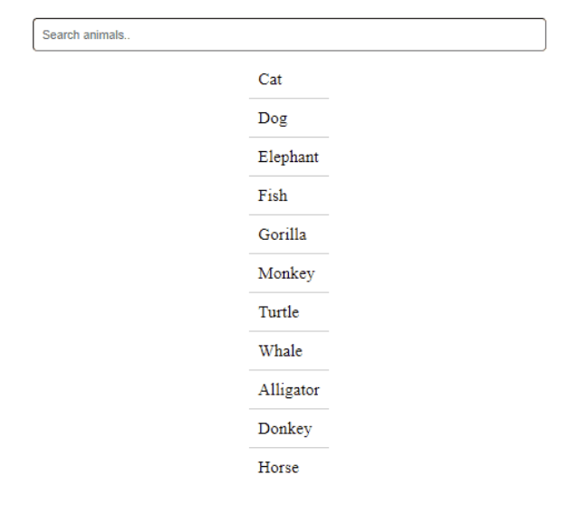
	<figcaption>Search Bar example with animals.</figcaption>
  </figure>
</p>
<!--~~~~~~~~~~~~~~~~~~~~~~~~~~~~~~~~~~~~~~~~~~-->
<h3>Approach</h3>
<!--~~~~~~~~~~~~~~~~~~~~~~~~~~~~~~~~~~~~~~~~~~-->
<ul>
  <li>Create HTML with a search input and an ordered list of animals.</li>
  <li>Now assign the relevant IDs and classes to particular input boxes and list items.</li>
  <li>Apply initial styles for the container, search bar, and list items. Consider animations 
    or transitions for visual appeal.</li>
  <li>Write a function (search_animal()) to handle input, loop through items, and toggle 
    display based on content match.</li>
</ul>
<!--~~~~~~~~~~~~~~~~~~~~~~~~~~~~~~~~~~~~~~~~~~-->
<h4>Example: In this example, we will see the implementation of the above search bar with HTML and with an example.</h4>
<!--~~~~~~~~~~~~~~~~~~~~~~~~~~~~~~~~~~~~~~~~~~-->
<h4>HTML</h4>
<!--~~~~~~~~~~~~~~~~~~~~~~~~~~~~~~~~~~~~~~~~~~-->
<details>
  <summary>HTML</summary>

<pre>
&lt;!DOCTYPE html&gt;
&lt;html lang="en"&gt;
&lt;head&gt;
    &lt;meta charset="UTF-8"&gt;
    &lt;meta name="viewport" 
          content="width=device-width, initial-scale=1.0"&gt;
    &lt;title&gt;Search Bar Example&lt;/title&gt;
    &lt;link rel="stylesheet" 
          type="text/css" href="./style.css"&gt;
&lt;/head&gt;
&lt;body&gt;
  &lt;div class="container"&gt;
    &lt;input id="searchbar" 
      onkeyup="search_animal()" 
      type="text" name="search" 
      placeholder="Search animals.."&gt;
    &lt;ul id='list'&gt;
      &lt;li class="animals"&gt;Cat&lt;/li&gt;
      &lt;li class="animals"&gt;Dog&lt;/li&gt;
      &lt;li class="animals"&gt;Elephant&lt;/li&gt;
      &lt;li class="animals"&gt;Fish&lt;/li&gt;
      &lt;li class="animals"&gt;Gorilla&lt;/li&gt;
      &lt;li class="animals"&gt;Monkey&lt;/li&gt;
      &lt;li class="animals"&gt;Turtle&lt;/li&gt;
      &lt;li class="animals"&gt;Whale&lt;/li&gt;
      &lt;li class="animals"&gt;Alligator&lt;/li&gt;
      &lt;li class="animals"&gt;Donkey&lt;/li&gt;
      &lt;li class="animals"&gt;Horse&lt;/li&gt;
    &lt;/ul&gt;
  &lt;/div&gt;
  &lt;script src="./script.js"&gt;&lt;/script&gt;
&lt;/body&gt;
&lt;/html&gt;
</pre>

</details>
<!--~~~~~~~~~~~~~~~~~~~~~~~~~~~~~~~~~~~~~~~~~~-->
<h4>CSS</h4>
<!--~~~~~~~~~~~~~~~~~~~~~~~~~~~~~~~~~~~~~~~~~~-->
<details>
  <summary>CSS</summary>
<pre>
* {
  margin: 0;
  padding: 0;
  box-sizing: border-box;
}
.container {
  display: flex;
  flex-direction: column;
  align-items: center;
  margin: 20px;
}
#searchbar {
  margin: 10px;
  padding: 10px;
  border-radius: 5px;
  width: 50%;
  box-sizing: border-box;
}
#list {
  list-style: none;
  padding: 0;
  margin: 0;
}
.animals {
  font-size: 1.2em;
  padding: 10px;
  border-bottom: 1px solid #ccc;
  animation: fadeIn 0.5s ease-in-out;
}
.animals:last-child {
  border-bottom: none;
}
@keyframes fadeIn {
  from {
    opacity: 0;
    transform: translateY(-10px);
  }
  to {
    opacity: 1;
    transform: translateY(0);
  }
}
</pre>
</details>
<!--~~~~~~~~~~~~~~~~~~~~~~~~~~~~~~~~~~~~~~~~~~-->
<h4>JavaScript</h4>
<!--~~~~~~~~~~~~~~~~~~~~~~~~~~~~~~~~~~~~~~~~~~-->
<details>
  <summary>JavaScript</summary>
<pre>
// JavaScript code
function search_animal() {
  let input = document.getElementById('searchbar').value
  input = input.toLowerCase();
  let x = document.getElementsByClassName('animals');
  for (i = 0; i < x.length; i++) {
    if (!x[i].innerHTML.toLowerCase().includes(input)) {
      x[i].style.display = "none";
    }
    else {
      x[i].style.display = "list-item";
    }
  }
}
</pre>
</details>
<!--~~~~~~~~~~~~~~~~~~~~~~~~~~~~~~~~~~~~~~~~~~-->
<h4>Output:</h4>
<!--~~~~~~~~~~~~~~~~~~~~~~~~~~~~~~~~~~~~~~~~~~~~~~~~~~~~~~~~~~~~~~~~~~~~~~~~~~~~~~~~~~~~~~~~~~~~-->
<!--~~~~~~~~~~~~~~~~~~~~~~~~~~~~~~~ 02. search example animated ~~~~~~~~~~~~~~~~~~~~~~~~~~~~~~~~-->
<!-- image-search-02.gif -->
<p align="center" width="100%">
  <figure>
    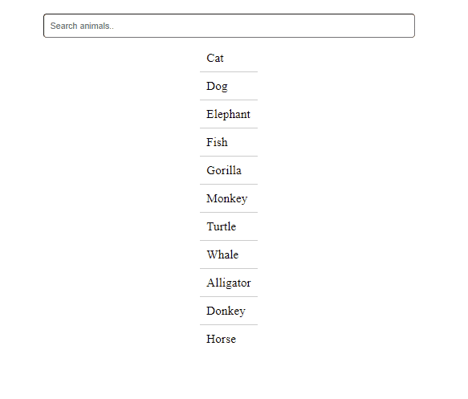
  	<figcaption>Search Bar using HTML CSS and JavaScript.</figcaption>
  </figure>
</p>
<p>JavaScript is best known for web page development but it is also used in a variety of non-browser 
environments. You can learn JavaScript from the ground up by following this 
<a href="https://www.geeksforgeeks.org/javascript-tutorial/">JavaScript Tutorial</a> and 
<a href="https://www.geeksforgeeks.org/javascript-examples/">JavaScript Examples</a>.</p>

<p>HTML is the foundation of webpages, is used for webpage development by structuring websites 
and web apps. You can learn HTML from the ground up by following 
<a href="https://www.geeksforgeeks.org/html-tutorials/">this HTML Tutorial</a> and 
<a href="">HTML Examples</a>.</p>

<p>CSS is the foundation of webpages, is used for webpage development by styling websites 
and web apps. You can learn CSS from the ground up by following 
<a href="https://www.geeksforgeeks.org/css-tutorials/">this CSS Tutorial</a> and 
<a href="https://www.geeksforgeeks.org/css-examples/">CSS Examples</a>.</p>
<!--~~~~~~~~~~~~~~~~~~~~~~~~~~~~~~~~~~~~~~~~~~~~~~~~~~~~~~~~~~~~~~~~~~~~~~~~~~~~~~~~~~~~~~~~~~~~-->
<h2 id="03">03. How to Add Map in HTML?</h2>
<!--~~~~~~~~~~~~~~~~~~~~~~~~~~~~~~~~~~~~~~~~~~~~~~~~~~~~~~~~~~~~~~~~~~~~~~~~~~~~~~~~~~~~~~~~~~~~-->
<p>When building websites, including a map is often necessary to display important locations, 
such as office addresses, at the footer or on dedicated pages. Adding a map enhances user 
experience, making it easier for users to locate your business or other important points 
of interest.</p>
<!--~~~~~~~~~~~~~~~~~~~~~~~~~~~~~~~~~~~~~~~~~~-->
<h4>Prerequisites</h4>
<!--~~~~~~~~~~~~~~~~~~~~~~~~~~~~~~~~~~~~~~~~~~-->
<p>Basic knowledge of HTML and CSS is required to follow along with the examples.</p>
<!--~~~~~~~~~~~~~~~~~~~~~~~~~~~~~~~~~~~~~~~~~~-->
<h3>Methods to Add a Map in HTML</h3>
<!--~~~~~~~~~~~~~~~~~~~~~~~~~~~~~~~~~~~~~~~~~~-->
<p>Now, let's explore two popular approaches for adding maps to a webpage:</p>
<!--~~~~~~~~~~~~~~~~~~~~~~~~~~~~~~~~~~~~~~~~~~-->
<h4>Table of Contents</h4>
<!--~~~~~~~~~~~~~~~~~~~~~~~~~~~~~~~~~~~~~~~~~~-->
<ul>
  <li>Methods to Add a Map in HTML
    <ul>
	  <li>Using &lt;iframe&gt; to Embed Google Maps</li>
      <li>Using Leaflet.js to Add Interactive Maps</li>
	</ul>
  </li>
</ul>
<p>Now we will learn one by one how we can add maps in HTML.</p>
<!--~~~~~~~~~~~~~~~~~~~~~~~~~~~~~~~~~~~~~~~~~~-->
<h3>1. Using <b><mark>&lt;iframe&gt;</mark></b> to Embed Google Maps</h3>
<!--~~~~~~~~~~~~~~~~~~~~~~~~~~~~~~~~~~~~~~~~~~-->
<p>The easiest and most commonly used method to add a map in HTML is by embedding a Google 
Map using the <b><mark>&lt;iframe&gt;</mark></b> tag. Google Maps provides an option to 
generate an embed code that you can copy and paste directly into your HTML document.</p>
<!--~~~~~~~~~~~~~~~~~~~~~~~~~~~~~~~~~~~~~~~~~~-->
<h4>Steps to Embed Google Maps:</h4>
<!--~~~~~~~~~~~~~~~~~~~~~~~~~~~~~~~~~~~~~~~~~~-->
<ol>
  <li>Go to Google Maps.</li>
  <li>Search for the location you want to display.</li>
  <li>Click the Share option and choose Embed a Map.</li>
  <li>Copy the provided <b><mark>&lt;iframe&gt;</mark></b> code and paste it into your HTML 
    where you want the map to appear.</li>
</ol>
<!--~~~~~~~~~~~~~~~~~~~~~~~~~~~~~~~~~~~~~~~~~~-->
<h4>Syntax:</h4>
<!--~~~~~~~~~~~~~~~~~~~~~~~~~~~~~~~~~~~~~~~~~~-->
<pre>
&lt;iframe src="https://www.google.com/maps/embed?pb=YourMapURL"
    width="600" height="450" style="border:0;" allowfullscreen="" loading="lazy"&gt;
&lt;/iframe&gt;
</pre>

<!--~~~~~~~~~~~~~~~~~~~~~~~~~~~~~~~~~~~~~~~~~~-->
<h4>Example: Below given example demonstrates how to embed a goggle map into a webpage 
using an <b><mark>&lt;iframe&gt;</mark></b> element. It shows a webpage with centered 
heading and a google map showing specific location.</h4>
<!--~~~~~~~~~~~~~~~~~~~~~~~~~~~~~~~~~~~~~~~~~~-->
<details>
  <summary>HTML</summary>

```
<!-- Using iframe -->
<!DOCTYPE html>
<html>

<head>
    <title>Embed Google Map</title>
</head>

<body style="display: grid;
 justify-content: center">
    <h2 style="text-align: center">
        Add map in html using iframe</h2>
    <iframe src="https://www.google.com/maps/embed?pb
    =!1m18!1m12!1m3!1d4291.745453141256!2d
    77.39914006293347!3d28.504393188935435!
    2m3!1f0!2f0!3f0!3m2!1i1024!2i768!4f13.1
    !3m3!1m2!1s0x390ce626851f7009%3A0x62118
    5133cfd1ad1!2sGeeksforGeeks%20%7C%20
    Coding%20Classes%20%7C%20Noida!5e0!3m2!1
    sen!2sin!4v1725395799894!5m2!1sen!2sin" width="600" height="450" style="border: 0" allowfullscreen=""
        loading="lazy" referrerpolicy="no-referrer-when-downgrade">
    </iframe>
</body>

</html>
```

</details>
<!--~~~~~~~~~~~~~~~~~~~~~~~~~~~~~~~~~~~~~~~~~~-->
<h4>Output:</h4>
<!--~~~~~~~~~~~~~~~~~~~~~~~~~~~~~~~~~~~~~~~~~~~~~~~~~~~~~~~~~~~~~~~~~~~~~~~~~~~~~~~~~~~~~~~~~~~~-->
<!--~~~~~~~~~~~~~~~~~~~~~~~~~~~~~~~~ 01. map image using iframe ~~~~~~~~~~~~~~~~~~~~~~~~~~~~~~~~-->
<!-- image-map01.jpg -->
<p align="center" width="100%">
  <figure>
    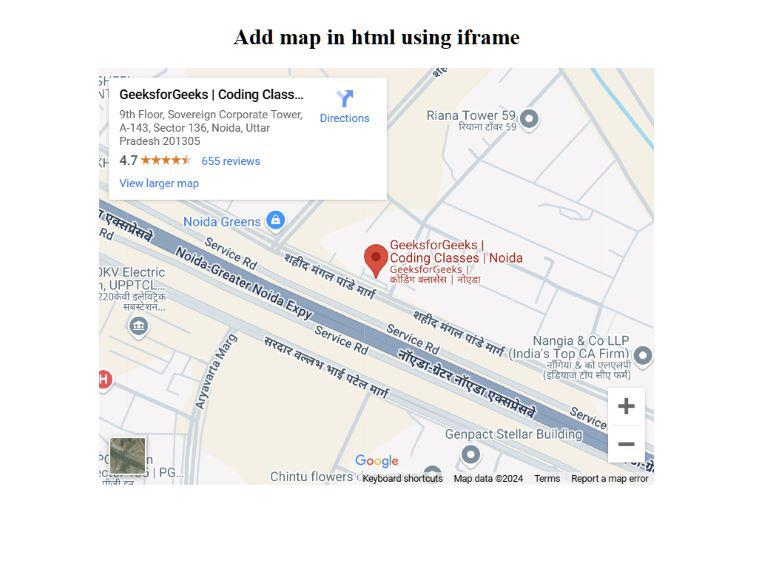
    <figcaption>Add map in HTML using iframe.</figcaption>
  </figure>
</p>
<!--~~~~~~~~~~~~~~~~~~~~~~~~~~~~~~~~~~~~~~~~~~-->
<h3>2. Using <b><mark>Leaflet.js</mark></b> to Add Interactive Maps</h3>
<!--~~~~~~~~~~~~~~~~~~~~~~~~~~~~~~~~~~~~~~~~~~-->
<p><b><mark>Leaflet</mark></b> is a popular open source library to add interactive maps in our website. It is a 
Javascript library for mobile friendly lighweight and interactive maps. It is designed to 
be easy to use and mobile-friendly.It is customizable, as you can customize it with variety 
of additional plugins.</p>
<!--~~~~~~~~~~~~~~~~~~~~~~~~~~~~~~~~~~~~~~~~~~-->
<h4>Steps to Use <b><mark>Leaflet.js</mark></b>:</h4>
<!--~~~~~~~~~~~~~~~~~~~~~~~~~~~~~~~~~~~~~~~~~~-->
<ol>
  <li>Include the <b><mark>Leaflet.js</mark></b> library: Link the CSS and JavaScript files in your HTML document.</li>
  <li>Create a map container: Add a &lt;div&gt; element where the map will be displayed.</li>
  <li>Initialize the map: Use <b><mark>Leaflet.js</mark></b> to create the map and set the center coordinates and zoom level.</li>
</ol>
<!--~~~~~~~~~~~~~~~~~~~~~~~~~~~~~~~~~~~~~~~~~~-->
<h4>Syntax:</h4>
<!--~~~~~~~~~~~~~~~~~~~~~~~~~~~~~~~~~~~~~~~~~~-->
<pre>
let map = L.map('map').setView([Latitude, Longitude], ZoomLevel);

L.tileLayer('https://tile.openstreetmap.org/{z}/{x}/{y}.png', {
    attribution: '&copy; <a href="https://www.openstreetmap.org/copyright">OpenStreetMap</a> contributors'
}).addTo(map);

L.marker([Latitude, Longitude]).addTo(map)
    .bindPopup('Popup Text Here.')
    .openPopup();
</pre>
<!--~~~~~~~~~~~~~~~~~~~~~~~~~~~~~~~~~~~~~~~~~~-->
<h4>Example: Below is the example for creating interactive map in our website using 
<b><mark>leaflet.js</mark></b>, it is a open-source javascript library. The map centers on India Gate, 
New Delhi and displays it with marker.</h4>
<!--~~~~~~~~~~~~~~~~~~~~~~~~~~~~~~~~~~~~~~~~~~-->
<details>
  <summary>HTML</summary>

```
<!-- Using leaflet Map -->
<!DOCTYPE html>
<html>

<head>
    <title>Leaflet Map Example</title>
    <link rel="stylesheet" href="
    https://unpkg.com/leaflet@1.9.4/dist/leaflet.css" integrity="sha256-p4NxAoJBhIIN+hmNHrzRCf9tD/miZy
    oHS5obTRR9BMY=" crossorigin="" />
    <script src="https://unpkg.com/leaflet@1.9.4/dist/leaflet.js" integrity="sha256-20nQCchB9co0qIjJZRGuk2/Z9V
        M+kNiyxNV1lvTlZBo=" crossorigin=""></script>
</head>

<body>
    <h2 style="text-align: center;">
        India Gate Location</h2>
    <div id="mapid" style="height: 75vh; width: 50vw;
     margin-left: 25%;"></div>
    <script>
        var map = L.map("mapid").setView
            ([28.612894, 77.229446], 13); L.tileLayer
                ("https://{s}.tile.openstreetmap.org/{z}/{x}/{y}.png", {
                    attribution: "&copy; OpenStreetMap contributors",
                }).addTo(map);
        L.marker([28.612894, 77.229446])
            .addTo(map)
            .bindPopup("India Gate, New Delhi")
            .openPopup();
    </script>
</body>

</html>
```

</details>
<!--~~~~~~~~~~~~~~~~~~~~~~~~~~~~~~~~~~~~~~~~~~-->
<h4>Output:</h4>
<!--~~~~~~~~~~~~~~~~~~~~~~~~~~~~~~~~~~~~~~~~~~~~~~~~~~~~~~~~~~~~~~~~~~~~~~~~~~~~~~~~~~~~~~~~~~~~-->
<!--~~~~~~~~~~~~~~~~~~~~~~~~~~~~~~ 02. map image using leaflet.js ~~~~~~~~~~~~~~~~~~~~~~~~~~~~~~-->
<!-- image-map-02.jpg -->
<p align="center" width="100%">
  <figure>
    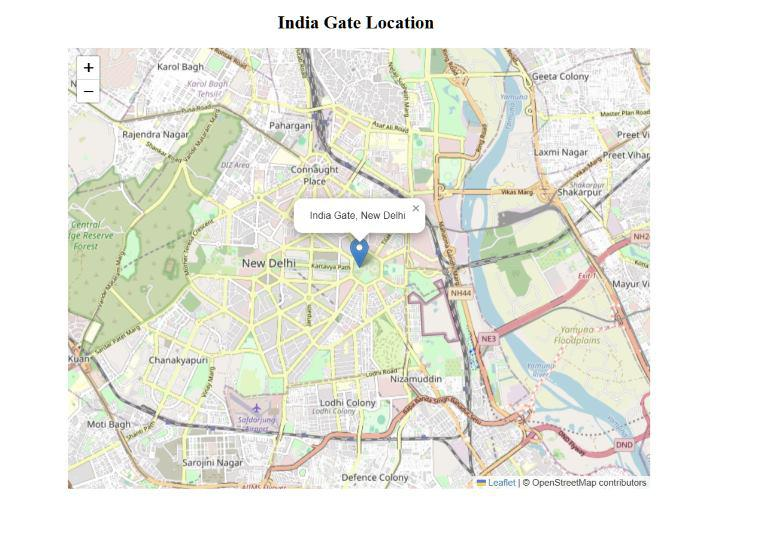
	<figcaption>Add map in HTML using leaflet.js.</figcaption>
  </figure>
</p>
<!--~~~~~~~~~~~~~~~~~~~~~~~~~~~~~~~~~~~~~~~~~~~~~~~~~~~~~~~~~~~~~~~~~~~~~~~~~~~~~~~~~~~~~~~~~~~~-->
<h2 id="04">04. Design Joke Generator App in HTML CSS &amp; JavaScript</h2>
<!--~~~~~~~~~~~~~~~~~~~~~~~~~~~~~~~~~~~~~~~~~~~~~~~~~~~~~~~~~~~~~~~~~~~~~~~~~~~~~~~~~~~~~~~~~~~~-->
<p>We will go to learn how can we create a Joke generator app using HTML, CSS, and JavaScript. We 
will also add a feature to copy the generated joke. We will use API to fetch the jokes and will 
show those jokes on the screen.</p>

<!--~~~~~~~~~~~~~~~~~~~~~~~~~~~~~~~~~~~~~~~~~~-->
<h4>Prerequisites</h4>
<!--~~~~~~~~~~~~~~~~~~~~~~~~~~~~~~~~~~~~~~~~~~-->
<ul>
  <li>HTML</li>
  <li>CSS</li>
  <li>JavaScript</li>
</ul>
<!--~~~~~~~~~~~~~~~~~~~~~~~~~~~~~~~~~~~~~~~~~~-->
<h3>Approach</h3>
<!--~~~~~~~~~~~~~~~~~~~~~~~~~~~~~~~~~~~~~~~~~~-->
<p>Create the Joke Generator Application UI Structure using HTML Elements like &lt;div&gt;, 
&lt;h1&gt;, &lt;button&gt;. Then link all the required CDNs for external fonts and icons. 
Once we design the structure of the application, then we can style the elements and the 
application using CSS properties for a responsive and attractive layout with different 
properties like width, padding, height, etc.</p>
<p>In the JavaScript code, as we are fetching the Joke from the external API, we need to 
define the function jokeFn() which requests the External API for the joke and once the 
joke is received, it is displayed in the Application's UI.</p>
<p>The cpyFn() allows us to copy the generated Joke to the clipboard for further use.
Example: This example describes the basic implementation for a Joke generator App in 
HTML, CSS & JavaScript.</p>

<!--~~~~~~~~~~~~~~~~~~~~~~~~~~~~~~~~~~~~~~~~~~-->
<h4>HTML</h4>
<!--~~~~~~~~~~~~~~~~~~~~~~~~~~~~~~~~~~~~~~~~~~-->
<details>
  <summary>HTML</summary>

```
<!DOCTYPE html>
<html lang="en">

<head>
	<link rel="stylesheet" href=
"https://cdnjs.cloudflare.com/ajax/libs/animate.css/4.1.1/animate.min.css">
	<link rel="stylesheet" href="style.css">
	<title>Joke Generator</title>
</head>

<body>
	<div class="container">
		<div class="joke-container animate__animated animate__fadeIn">
			<h1 class="app-title">GeeksforGeeks Joke Generator</h1>
			<i class="laugh-icon"></i>
			<p id="jokeText">Loading joke...</p>
			<button id="newJokeBtn"><i class="random-icon">
			</i> New Joke</button>
			<button id="copyJokeBtn"><i class="copy-icon">
			</i> Copy Joke</button>
		</div>
	</div>
	<script src="script.js"></script>
</body>

</html>
```

</details>
<!--~~~~~~~~~~~~~~~~~~~~~~~~~~~~~~~~~~~~~~~~~~-->
<h4>CSS</h4>
<!--~~~~~~~~~~~~~~~~~~~~~~~~~~~~~~~~~~~~~~~~~~-->
<details>
  <summary>CSS</summary>

```
body {
	margin: 0;
	padding: 0;
	font-family: 'Montserrat', sans-serif;
	background: linear-gradient(to right,
			#3494E6, #EC6EAD);
	height: 100vh;
	display: flex;
	align-items: center;
	justify-content: center;
}
.container {
	text-align: center;
}
.app-title {
	color: #4CAF50;
	font-size: 32px;
	margin-bottom: 20px;
}
.joke-container {
	padding: 20px;
	background: #fff;
	border-radius: 10px;
	width: 60%;
	height: 60%;
	box-shadow: 0 4px 8px rgba(0, 0, 0, 0.2);
	margin: 20px;
	overflow: hidden;
}
.laugh-icon,
.random-icon,
.copy-icon {
	font-size: 20px;
	margin-bottom: 10px;
	color: #FFD700;
}
#jokeText {
	font-size: 18px;
	color: #555;
	margin: 20px 10px;
}
button {
	padding: 12px 30px;
	font-size: 18px;
	background: #FF4848;
	color: #fff;
	border: none;
	border-radius: 5px;
	margin: 20px 10px;
	cursor: pointer;
	transition: background 0.3s ease-in-out;
}
button:hover {
	background: #FF6565;
}
@media screen and (max-width: 600px) {
	.joke-container {
		width: 90%;
	}
}
```

</details>
<!--~~~~~~~~~~~~~~~~~~~~~~~~~~~~~~~~~~~~~~~~~~-->
<h4>JavaScript</h4>
<!--~~~~~~~~~~~~~~~~~~~~~~~~~~~~~~~~~~~~~~~~~~-->
<details>
  <summary>JavaScript</summary>

```
const joke = document.getElementById('jokeText');
const jokeBtn = document.getElementById('newJokeBtn');
const cpyBtn = document.getElementById('copyJokeBtn');
jokeBtn.addEventListener('click', jokeFn);
cpyBtn.addEventListener('click', cpyFn);
jokeFn();
function jokeFn() {
	fetch('...')
		.then(response => response.json())
		.then(data => {
			joke.textContent = data.joke;
		})
		.catch(error => {
			console.error('Error fetching joke:', error);
			joke.textContent = 'Failed to fetch joke. Please try again.';
		});
}
function cpyFn() {
	const textArea = document.createElement('textarea');
	textArea.value = joke.textContent;
	document.body.appendChild(textArea);
	textArea.select();
	document.execCommand('copy');
	document.body.removeChild(textArea);
	alert('Joke copied to clipboard!');
}
```

</details>
<!--~~~~~~~~~~~~~~~~~~~~~~~~~~~~~~~~~~~~~~~~~~-->
<h4>Output</h4>
<!--~~~~~~~~~~~~~~~~~~~~~~~~~~~~~~~~~~~~~~~~~~~~~~~~~~~~~~~~~~~~~~~~~~~~~~~~~~~~~~~~~~~~~~~~~~~~-->
<h2 id="05">05. Create a Stack Visualizer using HTML CSS and Javascript</h2>
<!--~~~~~~~~~~~~~~~~~~~~~~~~~~~~~~~~~~~~~~~~~~~~~~~~~~~~~~~~~~~~~~~~~~~~~~~~~~~~~~~~~~~~~~~~~~~~-->
<p>In this article, we will see how to create a stack visualizer using HTML, CSS & Javascript, 
along with understanding its implementation through the illustration.</p>

<p>Stack is a well-known linear data structure that may follow the order LIFO(Last In First Out) 
or FILO(First In Last Out).</p>

<!-- image-stack-01.png -->
<p align="center" width="100%">
  <figure>
    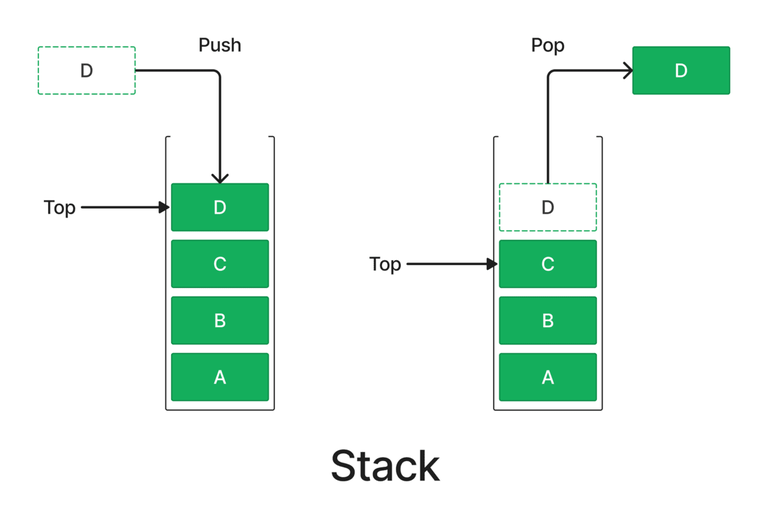
	<figcaption>Stack.</figcaption>
  </figure>
</p>
<p>There are many real-life examples of a stack. Like, the stack of books in a library is a good 
real-life example of a stack. If we want to clear the stack then we have to remove the first 
book or the top book of the stack, i.e. the book which has been placed at the bottommost 
position remains in the stack for the longest period of time. So, it follows the order 
LIFO(Last In First Out)/FILO(First In Last Out) order.</p>

<p>In this article, we are going to tell how to build the stack visualizer from the scratch 
using HTML, CSS and Javascript. In this stack visualizer, we have a bucket in which we can 
put the elements and the bucket has a limit of containing a certain number of elements. 
When the limit is crossed, but we try to put an element the stack overflow message will be 
displayed in the message box and then we need to pop the element from the stack to insert 
new elements. Also when we want to pop an element from an empty stack then the stack underflow 
message will be displayed in the message box.</p>
<!--~~~~~~~~~~~~~~~~~~~~~~~~~~~~~~~~~~~~~~~~~~-->
<h3>Approach</h3>
<!--~~~~~~~~~~~~~~~~~~~~~~~~~~~~~~~~~~~~~~~~~~-->
<p>The following approach will be utilized to create the Stack Visualizer:</p>

<ul>
  <li>Create a project folder and inside it create three files "index.html"(for writing the HTML), 
    "style.css"(for writing the CSS), and "index.js"(for writing the js). You can also create a 
    separate file to keep the CSS code for the responsiveness of the page.</li>
  <li>Now first create the interface of the visualizer using HTML & CSS. First Create a heading. 
    Then after the heading create a container box which will contain the whole visualizer. Now 
    inside this container add one input box and three buttons for pushing an element, popping an 
    element and resetting the visualizer.</li>
  <li>Then below the input and the buttons create a bucket using a div and give the border left, 
    right and the bottom and make the top border none in the CSS. This way you can create the 
    bucket.</li>
  <li>On the left side of the bucket make four options to show the top of the stack, recently 
    popped element, recently pushed element and the size of the stack. Also, create a message 
    box under the info section to show the message. Use flexbox properties to align and justify 
    all content in the right place.</li>
  <li>Now add some javascript to create the visualizer totally working. First, select all elements 
which you need to use in javascript using the "document.querySelector" and store them inside 
variables. Also, declare an empty array which we use and maintain as an internal stack.</li>
  <li>Now make two functions, one to disable the three buttons and the second one to enable three 
buttons. Use the "button.disabled = true" to disable the button and "button.disabled = false". 
You can also add any style for disabled buttons by "classList.add" if needed.</li>
  <li>Now write the function for the push button. First, add a click "eventListener" to the push 
button. Then add a call-back function to the event listener. In this function, first, add 
an if condition for blank input and show an error message and return. After that add another 
if condition for checking the stack overflow condition. At last, write the code to a new 
element in the bucket. Use document.createElement("div") to create a new element and add 
this element to the bucket using the "bucket.appendChild( )" function. Also, update the 
internal stack or the array. You can also add the setTimeout function to show the adding 
element delay. Also, disable the three buttons during the element pushing time. After pushing 
the element, update the value of the top, recently pushed element details and show a successful 
message in the message box.</li>
<li>Now write the function for the Pop button. first, check the stack underflow condition using the 
if statement. If the stack has no element then show a message of stack underflow. If not, then 
pop the last element by using "bucket.removeChild" and also delete the last element of the 
internal stack. At last update the top and the recently popped element. You can also add the 
setTimeout function to show the popping element delay with animation.</li>
<li>At last, write the function of the reset button. First, clear the internal stack. Then make 
all info content blank by using ".innerHTML" and delete all elements from the bucket by using 
"bucket.removeChild".</li>
</ul>

<h4>Example: This example illustrates how to build a stack visualizer using HTML CSS & Javascript.</h4>

<details>
  <summary>CSS</summary>

```
@import url("https://fonts.googleapis.com/css2?family=Poppins:ital,wght@0,100;0,200;0,300;0,400;0,500;0,600;0,700;0,800;0,900;1,100;1,200;1,300;1,400;1,500;1,600;1,700;1,800;1,900&display=swap");

* {
    margin: 0;
    padding: 0;
    box-sizing: border-box;
    font-family: "Poppins", sans-serif;
}
body {
    height: 100vh;
    width: 100vw;
    display: flex;
    justify-content: start;
    align-items: center;
    flex-direction: column;
    gap: 20px;
    background-color: rgb(231, 231, 231);
}
header {
    height: 100px;
    width: 100%;
    display: flex;
    flex-direction: column;
    align-items: center;
    justify-content: center;
    gap: 8px;
}
.heading {
    color: green;
}
.container {
    height: 620px;
    width: 1000px;
    background-color: white;
    box-shadow: 8px 8px 20px rgb(128, 128, 128);
    position: relative;
    overflow: hidden;
    border-radius: 20px;
}
.container-header {
    height: 90px;
    width: 100%;
    display: flex;
    justify-content: center;
    align-items: center;
    gap: 20px;
    margin-bottom: 20px;
    margin-top: 10px;
}
.container-header input {
    height: 50px;
    width: 400px;
    font-size: 25px;
    border-radius: 10px;
    padding-left: 20px;
    padding-right: 5px;
}
.push,
.pop,
.reset,
.box {
    height: 50px;
    width: 140px;
    font-size: 25px;
    background-color: green;
    color: white;
    border-radius: 10px;
    cursor: pointer;
    transition: 0.2s;
    border: none;
}
.disable-button {
    background-color: rgb(0, 59, 0);
}
.container-header button:active {
    transform: scale(0.95);
}
.container-body {
    width: 1000px;
    display: flex;
    justify-content: space-evenly;
    align-items: center;
}
.stack {
    width: 500px;
    height: 470px;
    display: flex;
    justify-content: center;
    align-items: center;
    border-width: 0 3px 0 0;
    border-color: black;
    border-style: solid;
}
.main-stack-bucket {
    height: 450px;
    width: 200px;
    border-width: 0 4px 4px 4px;
    border-color: black;
    border-style: solid;
    border-radius: 0 0 10px 10px;
    display: flex;
    justify-content: end;
    align-items: center;
    flex-direction: column-reverse;
    gap: 5px;
    padding-bottom: 5px;
}
.ele {
    height: 80px;
    width: 170px;
    background-color: green;
    color: white;
    border: 4px black solid;
    border-radius: 10px;
    font-size: 25px;
    display: flex;
    justify-content: center;
    align-items: center;
}
.ele-add {
    animation: pushAnimation 0.3s infinite linear;
}
.ele-remove {
    animation: popAnimation 0.3s infinite linear;
}
@keyframes pushAnimation {
    0% {
        background-color: green;
    }
    100% {
        background-color: rgb(17, 92, 255);
    }
}
@keyframes popAnimation {
    0% {
        background-color: green;
    }
    100% {
        background-color: rgb(255, 15, 59);
    }
}
.info {
    height: 470px;
    width: 500px;
    padding-left: 20px;
}
[class^="sec"] {
    display: flex;
    width: 350px;
    align-items: center;
    gap: 10px;
    margin-top: 10px;
    justify-content: space-between;
}
.massage-box {
    height: 180px;
    width: 400px;
    margin-top: 30px;
    padding: 10px;
    border-radius: 10px;
    background-color: bisque;
    display: flex;
    flex-direction: column;
    justify-content: space-between;
}
.massage-box h2 {
    text-align: center;
    font-weight: 600;
}
.massage {
    height: 160px;
    display: flex;
    align-items: center;
    justify-content: center;
    font-size: 30px;
}
.error-massage {
    animation: errorMassage 0.4s infinite linear;
}
@keyframes errorMassage {
    0% {
        background-color: bisque;
    }
    100% {
        background-color: rgb(255, 15, 59);
    }
}
```

</details>
<!--~~~~~~~~~~~~~~~~~~~~~~~~~~~~~~~~~~~~~~~~~~-->
<h4>Output</h4>
<!--~~~~~~~~~~~~~~~~~~~~~~~~~~~~~~~~~~~~~~~~~~-->
<!-- image-stack-02.gif -->
<p align="center" width="100%">
  <figure>
    
	<figcaption>Stack.</figcaption>
  </figure>
</p>
<!--~~~~~~~~~~~~~~~~~~~~~~~~~~~~~~~~~~~~~~~~~~~~~~~~~~~~~~~~~~~~~~~~~~~~~~~~~~~~~~~~~~~~~~~~~~~~-->
<h2 id="06">06. Create a Bookmark Landing Page using HTML CSS and JavaScript</h2>
<!--~~~~~~~~~~~~~~~~~~~~~~~~~~~~~~~~~~~~~~~~~~~~~~~~~~~~~~~~~~~~~~~~~~~~~~~~~~~~~~~~~~~~~~~~~~~~-->
<p>In this article, we are going to implement a Bookmark Landing Page using HTML, CSS, and 
JavaScript. Users can effortlessly add, manage, and remove bookmarks, resulting in a tidy 
digital library for their favorite websites. Bookmarking the Landing Page refers to a web 
page or website where the users bookmark the website, in order to save it in their web 
browser for easy and quick access.</p>
<!--~~~~~~~~~~~~~~~~~~~~~~~~~~~~~~~~~~~~~~~~~~-->
<h4>Final Output</h4>
<!--~~~~~~~~~~~~~~~~~~~~~~~~~~~~~~~~~~~~~~~~~~-->
<!-- image-bookmark-01.jpg only 1 image -->
<p align="center" width="100%">
  <figure>
    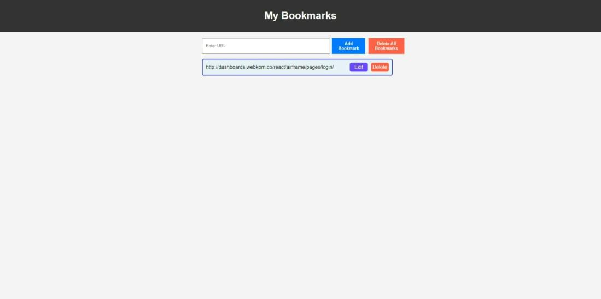
	<figcaption>Bookmark.</figcaption>
  </figure>
</p>

<!--~~~~~~~~~~~~~~~~~~~~~~~~~~~~~~~~~~~~~~~~~~-->
<h3>Approach</h3>
<!--~~~~~~~~~~~~~~~~~~~~~~~~~~~~~~~~~~~~~~~~~~-->
<ul>
  <li>Create a new project folder and organize it with the following files: index.html, 
    styles.css, and script.js.</li>
  <li>Open index.html in a code editor and create the basic HTML structure. Include a header, a form 
    for input, and an empty list for bookmarks.</li>
  <li>If the URL is not empty (form validations are successful).</li>
  <li>It creates a new list item (<li>) element to represent the bookmark.</li>
  <li>It adds the class "bookmark-item" to the list item to apply CSS styling.</li>
  <li>It sets the HTML content of the list item, including an anchor (<a>) element for the URL 
    and a "Delete" button.</li>
  <li>It appends the newly created list item to the list of bookmarks.</li>
  <li>It clears the input field for the next bookmark entry.</li>
  <li>It calls the addDeleteBookmarkListener function to add an event listener to the "Delete" button.</li>
  <li>When the "Delete" button is clicked, the associated bookmark item is removed from the list of bookmarks.</li>
  <li>In the styles.css file, add CSS rules to style your page. Use classes and IDs to target specific 
    elements and make the design visually appealing.</li>
  <li>In the script.js file, start by adding an event listener to handle adding bookmarks.</li>
</ul>
<p>Example: Below is the implementation of the Bookmark Landing Page using HTML, CSS, and JavaScript.</p>

<!--~~~~~~~~~~~~~~~~~~~~~~~~~~~~~~~~~~~~~~~~~~-->
<h4>HTML</h4>
<!--~~~~~~~~~~~~~~~~~~~~~~~~~~~~~~~~~~~~~~~~~~-->
<details>
  <summary>HTML</summary>

```
<!DOCTYPE html>
<html lang="en">
<head>
  <meta charset="UTF-8">
  <meta name="viewport" 
    content="width=device-width, 
      initial-scale=1.0">
  <title>Bookmark Landing Page</title>
  <link rel="stylesheet" 
       href="styles.css">
</head>
<body>
  <header>
    <h1>My Bookmarks</h1>
  </header>
  <main>
    <section class="bookmark-form">
      <input type="url" 
             name="url" 
             id="urlInput" 
             placeholder="Enter URL" 
             pattern="https://.*" 
             size="50" 
             required>
      <button id="addBookmark">
        Add Bookmark
      </button>
      <button id="deleteAll">
        Delete All Bookmarks
      </button>
    </section>
    <section class="bookmarks">
      <ul id="bookmarkList">
      <!-- Bookmarks will be added here dynamically -->
      </ul>
    </section>
  </main>
  <script src="script.js"></script>
</body>
</html>
```

</details>
<!--~~~~~~~~~~~~~~~~~~~~~~~~~~~~~~~~~~~~~~~~~~-->
<h4>CSS</h4>
<!--~~~~~~~~~~~~~~~~~~~~~~~~~~~~~~~~~~~~~~~~~~-->
<details>
  <summary>CSS</summary>

```
/* styles.css */
body {
  font-family: Arial, sans-serif;
  margin: 0;
  padding: 0;
  background-color: #f4f4f4;
}
header {
  width: 100%;
  background-color: #333;
  color: #fff;
  text-align: center;
  padding: 10px;
}
main {
  max-width: 600px;
  margin: 0 auto;
  padding: 20px;
}
.bookmark-form {
  display: flex;
  margin-bottom: 10px;
}
input[type="url"] {
  flex: 1;
  padding: 10px;
}
button#addBookmark {
  background-color: #007bff;
  color: #fff;
  border: none;
  padding: 10px 20px;
  cursor: pointer;
  font-weight: 600;
  margin-left: 6px;
}
button#addBookmark:hover {
  background-color: #160af3;
}
button#deleteAll {
  background-color: #ff6347;
  color: #fff;
  border: none;
  padding: 10px 20px;
  cursor: pointer;
  margin-left: 10px;
  font-weight: 600;
}
button#deleteAll:hover {
  background-color: #f80404;
}
.bookmark-item {
  background-color: #f5f5f5;
  padding: 10px;
  border: 2px solid #1d22b3;
  border-radius: 5px;
  display: flex;
  justify-content: space-between;
  align-items: center;
  margin-bottom: 10px;
  background-color: #e6f2f5;
}
.bookmark-item a {
  text-decoration: none;
  color: #0d0d0d;
}
.bookmark-item a:hover {
  text-decoration: underline;
}
/* Style the "Delete" button */
.delete {
  background-color: #ff6347; /* Red color */
  color: #fff; /* White text color */
  border: none;
  padding: 5px 5px;
  border-radius: 5px;
  font-size: medium;
  cursor: pointer;
  margin-left: 5px;
}
.delete:hover {
  background-color: #f80404;
}
.edit {
  background-color: #6947ff; /* Red color */
  color: #fff; /* White text color */
  border: none;
  padding: 5px 15px;
  border-radius: 5px;
  font-size: medium;
  cursor: pointer;
}
.edit:hover {
  background-color: #4b0da3;
}
ul {
  list-style: none;
  padding: 0;
}
li {
  display: flex;
  justify-content: space-between;
  margin-bottom: 10px;
}
a {
  text-decoration: none;
  color: #333;
}
a:hover {
  text-decoration: underline;
  color: rgb(40, 130, 189);
}
@media (max-width: 768px) {
  main {
    padding: 10px;
  }
  .bookmark-form {
    flex-direction: column;
  }
  input[type="url"],
  button#addBookmark,
  button#deleteAll {
    margin-left: 0;
    margin-bottom: 10px;
  }
}
@media (max-width: 345px) {
  main {
    padding: 10px;
  }
  .bookmark-form {
    flex-direction: column;
  }
  input[type="url"],
  button#addBookmark,
  button#deleteAll {
    margin-left: 0;
  }
}
```

</details>
<!--~~~~~~~~~~~~~~~~~~~~~~~~~~~~~~~~~~~~~~~~~~-->
<h4>JavaScript</h4>
<!--~~~~~~~~~~~~~~~~~~~~~~~~~~~~~~~~~~~~~~~~~~-->
<details>
  <summary>JavaScript</summary>

```
// Script.js
// Get DOM elements
const urlInput = 
  document.getElementById("urlInput");
const addBookmarkButton =
  document.getElementById("addBookmark");
const deleteAllButton = 
  document.getElementById("deleteAll");
const bookmarkList = 
  document.getElementById("bookmarkList");
// Function to validate URLs
function isValidURL(url) {
  const pattern =
    /^(https?:\/\/)?([\w-]+\.)+[\w-]+(\/[\w- .\/?%&=]*)?$/;
  return pattern.test(url);
}
// Event listener for adding a bookmark
addBookmarkButton.addEventListener(
  "click", () => {
    const url = urlInput.value.trim();
    if (isValidURL(url)) {
      const bookmarkItem = document.createElement("li");
      bookmarkItem.classList.add("bookmark-item");
      bookmarkItem.innerHTML = 
        `<a href="${url}" taret="_blank">${url}</a>
        <div class="buttons"> 
          <button class="edit"g>Edit</button>
          <button class="delete">Delete</button>
        </div>`;
        bookmarkList.appendChild(bookmarkItem);
        urlInput.value = "";
        addEditBookmarkListener(bookmarkItem);
        addDeleteBookmarkListener(bookmarkItem);
    }
    else {
      alert(
        "Please enter a valid URL (http:// or https://)."
      );
    }
});
// Event listener for deleting all bookmarks
deleteAllButton.addEventListener(
  "click", () => {
    while (
      bookmarkList.firstChild) {
      bookmarkList.removeChild
      (bookmarkList.firstChild)
    }
});
// Event listener for editing bookmarks
function addEditBookmarkListener(
  bookmarkItem) {
  const editButton = 
    bookmarkItem.querySelector(".edit");
  const bookmarkLink = 
    bookmarkItem.querySelector("a");
  editButton.addEventListener(
    "click", () => {
      const newURL = prompt("Edit the URL:",
        bookmarkLink.getAttribute("href"));
      if (newURL && isValidURL(newURL)) {
        bookmarkLink.setAttribute("href", newURL);
        bookmarkLink.innerHTML = newURL;
      }
      else if (newURL) {
        alert(
          "Please enter a valid URL (http:// or https://)."
        );
      }
  });
}
// Event listener for deleting a bookmark
function addDeleteBookmarkListener(
  bookmarkItem) {
    const deleteButton = 
      bookmarkItem.querySelector(".delete");
    deleteButton.addEventListener("click", () => { bookmarkItem.remove(); });
}
```

</details>
<!--~~~~~~~~~~~~~~~~~~~~~~~~~~~~~~~~~~~~~~~~~~~~~~~~~~~~~~~~~~~~~~~~~~~~~~~~~~~~~~~~~~~~~~~~~~~~-->
<h2 id="07">07. How to Add Icons in HTML?</h2>
<!--~~~~~~~~~~~~~~~~~~~~~~~~~~~~~~~~~~~~~~~~~~~~~~~~~~~~~~~~~~~~~~~~~~~~~~~~~~~~~~~~~~~~~~~~~~~~-->
<p>Icons in HTML are small images that show actions or items on a website, like a "home" button 
or a "search" symbol. They help people find things easily. To add icons in HTML, you can use an 
icon library like Font Awesome, Bootstrap Icons, Google Icons, and Image Icons.</p>
<!--~~~~~~~~~~~~~~~~~~~~~~~~~~~~~~~~~~~~~~~~~~-->
<h3>1. Using Font Awesome Icons</h3>
<!--~~~~~~~~~~~~~~~~~~~~~~~~~~~~~~~~~~~~~~~~~~-->
<p>Font Awesome is a popular icon library that provides scalable vector icons. To use Font Awesome, 
you need to include a CDN link to the library in your HTML document's &lt;head&gt; section. Then, you can 
use the appropriate class name associated with an inline element, such as the &lt;i&gt; tag, to display 
the required icon.</p>

```
<head>
  <!-- Include Font Awesome icon library -->
  <link href=
"https://cdnjs.cloudflare.com/ajax/libs/font-awesome/5.15.3/css/all.min.css" 
  rel="stylesheet" />
</head>

<body>
  <!-- Font Awesome Icon -->
  <i class="fas fa-home"></i>
</body>
```

<!--~~~~~~~~~~~~~~~~~~~~~~~~~~~~~~~~~~~~~~~~~~-->
<h4>Output:</h4>
<!--~~~~~~~~~~~~~~~~~~~~~~~~~~~~~~~~~~~~~~~~~~-->
<!-- image-fonticons-01.png -->
<p align="center" width="100%">
  <figure>
    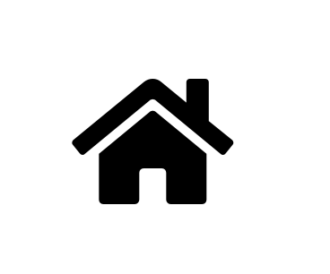
	<figcaption>Font-Awesome Icons (1).</figcaption>
  </figure>
</p>

<!--~~~~~~~~~~~~~~~~~~~~~~~~~~~~~~~~~~~~~~~~~~-->
<h3>2. Using Bootstrap Icons</h3>
<!--~~~~~~~~~~~~~~~~~~~~~~~~~~~~~~~~~~~~~~~~~~-->
<p>Bootstrap Icons are a collection of icons designed to be used with Bootstrap framework. 
To use Bootstrap Icons, include the Bootstrap Icons library using a CDN link in the &lt;head&gt; 
section of your HTML document. Then, use the &lt;i&gt; tag with the appropriate class name to 
display the icon.</p>

```
<head>
  <!-- Include Bootstrap Icons library -->
  <link href=
"https://cdn.jsdelivr.net/npm/bootstrap-icons/font/bootstrap-icons.css" 
  rel="stylesheet" />
</head>
<body>
  <!-- Bootstrap Icon -->
  <i class="bi bi-house-fill"></i>
</body>
```

<!--~~~~~~~~~~~~~~~~~~~~~~~~~~~~~~~~~~~~~~~~~~-->
<h4>Output:</h4>
<!--~~~~~~~~~~~~~~~~~~~~~~~~~~~~~~~~~~~~~~~~~~-->
<!-- image-fonticons-02.png -->
<p align="center" width="100%">
  <figure>
    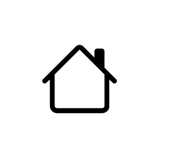
	<figcaption>Bootstrap Icons (2).</figcaption>
  </figure>
</p>

<!--~~~~~~~~~~~~~~~~~~~~~~~~~~~~~~~~~~~~~~~~~~-->
<h3>3. Using Google Icons (Material Icons)</h3>
<!--~~~~~~~~~~~~~~~~~~~~~~~~~~~~~~~~~~~~~~~~~~-->
<p>Google Icons, also known as Material Icons, provide a wide range of icons that follow Material 
Design guidelines. To use Google Icons, include the Google Icons library using a CDN link in the 
&lt;head&gt; section. Then, use the &lt;span&gt; tag with the class material-icons and specify 
the icon name.</p>

```
<head>
  <!-- Include Google Icons library -->
  <link href=
"https://fonts.googleapis.com/icon?family=Material+Icons" rel="stylesheet" />
</head>

<body>
  <!-- Google Icon -->
  <span class="material-icons">home</span>
</body>
```

<!--~~~~~~~~~~~~~~~~~~~~~~~~~~~~~~~~~~~~~~~~~~-->
<h4>Output:</h4>
<!--~~~~~~~~~~~~~~~~~~~~~~~~~~~~~~~~~~~~~~~~~~-->
<!-- image-fonticons-03.png -->
<p align="center" width="100%">
  <figure>
    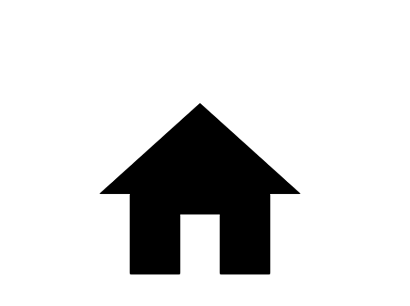
	<figcaption>Google Icons (3).</figcaption>
  </figure>
</p>
<!--~~~~~~~~~~~~~~~~~~~~~~~~~~~~~~~~~~~~~~~~~~-->
<h3>4. Using Image Icons</h3>
<!--~~~~~~~~~~~~~~~~~~~~~~~~~~~~~~~~~~~~~~~~~~-->
<p>You can also use image files as icons by utilizing the  tag . This method allows 
you to use custom images as icons. You can apply CSS to adjust the size of the icon as 
needed.</p>

```

```

<!--~~~~~~~~~~~~~~~~~~~~~~~~~~~~~~~~~~~~~~~~~~-->
<h4>Output:</h4>
<!--~~~~~~~~~~~~~~~~~~~~~~~~~~~~~~~~~~~~~~~~~~-->
<!-- image-fonticons-04.png -->
<p align="center" width="100%">
  <figure>
    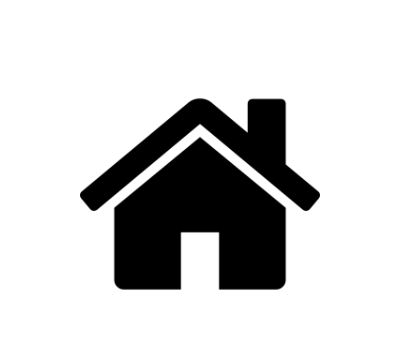
	<figcaption>Image Icons (4).</figcaption>
  </figure>
</p>

<h2 id="08">08. Build an AI Image Generator Website in HTML CSS and JavaScript</h2>
<p>Create an AI image generator website using HTML, CSS, and JavaScript by developing a user interface that lets users input text prompts and generate images by AI.</p>

<p>We incorporated API integration to fetch data, providing users with an effortless and dynamic experience in generating AI-driven images. An AI image generator website should have an input bar at the top of it, which simply accepts the text entered by the user and generates an image with the help of AI related to the entered text once the user submits the form or clicks the button to generate the image.</p>

<h4>Preview:</h4>
<!-- image-ai-01.png -->
<p align="center" width="100%">
  <figure>
    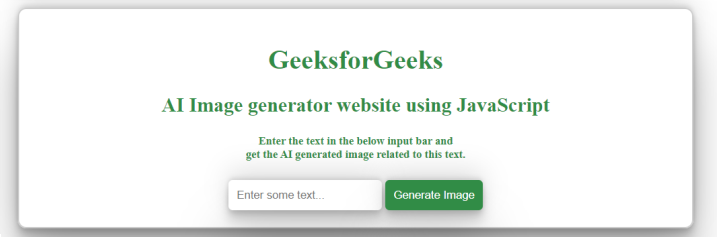
	<figcaption>AI Image Generator website preview.</figcaption>
  </figure>
</p>

<h3>Approach</h3>
<p>The below approach can be utilized to build an AI image generator website using HTML, CSS and JavaScript:</p>
<ul>
<li>Define a webpage with meta tags, title, and sections for headings, input form, and image display.</li>
<li>Styles the webpage layout, form elements, and adjusts container and image styles responsively.</li>
<li>Manages form submission, fetches random images based on entered text, and handles errors.</li>
<li>Utilizes media queries to adjust container width and image height for different screen sizes.</li>
<li>Provides error messages for failed image fetch requests and empty input fields.</li>
</ul>
<h4>Example: The below example will explain you the process and the practical implementation of creating an AI Image generator website with the help of HTML, CSS, and JavaScript:</h4>

<details>
  <summary>HTML</summary>
  
```
<!DOCTYPE html>
<html lang="en">

<head>
    <!-- Define the character encoding and viewport settings -->
    <meta charset="UTF-8">
    <meta name="viewport" content="width=device-width, initial-scale=1.0">
    
    <!-- Page title -->
    <title>
      AI Image generator Website using HTML, CSS and JavaScript
    </title>
    
    <!-- Link to external CSS file for styling -->
    <link rel="stylesheet" href="style.css">
</head>

<body>
    <!-- Main container for all the content -->
    <div class="main-container">

        <!-- Container for the heading and form -->
        <div class="container">
            
            <!-- Section for page headings -->
            <div class="headings-container">
                <h1>GeeksforGeeks</h1> <!-- Main heading -->
                <h2 class="heading">
                  	AI Image generator website using JavaScript
                </h2> <!-- Secondary heading explaining the purpose -->
                <h5 class="sub-heading">
                  Enter the text in the below input bar and 
                  <br />
                  get the AI generated image related to this text.
                </h5> <!-- Subheading with instructions -->
            </div>

            <!-- Form container for input and submit button -->
            <div id="generate-image-form" class="form-container">
                
                <!-- Form to input text and generate image -->
                <form class="my-form">
                    <!-- Text input for the user to enter some text -->
                    <input id="input-value" 
                           placeholder="Enter some text..." 
                           type="text"
                           class="form-input form-controls">

                    <!-- Button to submit and generate image -->
                    <button type="submit" 
                            class="image-generate-btn 
                                   form-controls">
                      	Generate Image
                    </button>
                </form>
            </div>

            <!-- Section to display the generated image -->
            <div id="images-visible" class="image-container">
                <!-- Placeholder text that will be updated with the result -->
                <p id="imageContainerText"></p>
                
                <!-- Image tag to display the AI generated image -->
                
            </div>
        </div>
    </div>

    <script src="index.js"></script>
</body>

</html>
```

</details>

<details>
  <summary>CSS</summary>
  
```
/* style.css */

body {
    padding: 0;
    margin: 0;
    box-sizing: border-box;
}

.main-container {
    display: flex;
    align-items: center;
    justify-content: center;
}

.container {
    padding: 20px;
    border: 2px solid #ccc;
    width: 50%;
    border-radius: 10px;
    box-shadow: 0 0 20px rgba(0, 0, 0, 0.2);
    display: flex;
    flex-direction: column;
    align-items: center;
    justify-content: center;
    background-repeat: no-repeat;
    background-size: cover;
    color: #fff;
}

.heading {
    color: #318C46;
}

.headings-container {
    text-align: center;
    color: #000;
}

.form-controls {
    padding: 10px;
    border-radius: 5px;
    border: none;
}

.form-input:focus {
    outline: none;
}

.image-generate-btn {
    background-color: #318C46;
    cursor: pointer;
    color: #fff;
}

#imageContainerText {
    color: #000;
}

.image-container {
    margin: 50px 0;
    display: none;
    text-align: center;
}

.my-generated-image {
    width: 100%;
    height: 350px;
}

@media screen and (min-width: 280px) and (max-width: 920px) {
    .container {
        width: 100%;
    }

    .my-generated-image {
        width: 100%;
        height: 300px;
    }
}
```

</details>

<details>
  <summary>JavaScript</summary>
  
```
// index.js

let generateImageForm = 
    document.getElementById('generate-image-form');
let formInput = 
    document.getElementById('input-value');
let imageContainerText = 
    document.getElementById('imageContainerText');
let imageGenerated = 
    document.getElementById('generated-image');
let imageContainer = 
    document.getElementById('images-visible');

async function fetchImages(category) {
    try {
        let response = 
        await fetch(`use a API`);
        if (!response.ok) {
            throw new Error('Unable to fetch the data');
        }
        imageContainerText.innerText = 
        "Below is your generated Image:";
        imageContainer.style.display = "block";
        imageGenerated.src = response.url;
        console.log(response.url);
    }
    catch (error) {
        console.log(error);
    }
}

generateImageForm.addEventListener('submit', (e) => {
    e.preventDefault();
    let enteredText = formInput.value;
    if (enteredText !== "") {
        fetchImages(enteredText);
    }
    else {
        imageContainerText.innerText = 
            "Input field can not be empty!";
    }
})
```

</details>

<h4>Output:</h4>
<!-- image-ai-02.mp4 -->
<p align="center" width="100%">
  <iframe src="./image/image-ai-02.mp4">
  <figure>
    
	<figcaption>Image AI.</figcaption>
  </figure>
  </iframe>
</p>


<h6>Date created: 5/14/2025 9+pm</h6>
<h6>Date editted: 5/15/2025 12:00+am</h6>
<h6>Date editted: 5/15/2025 9:00+am</h6>

